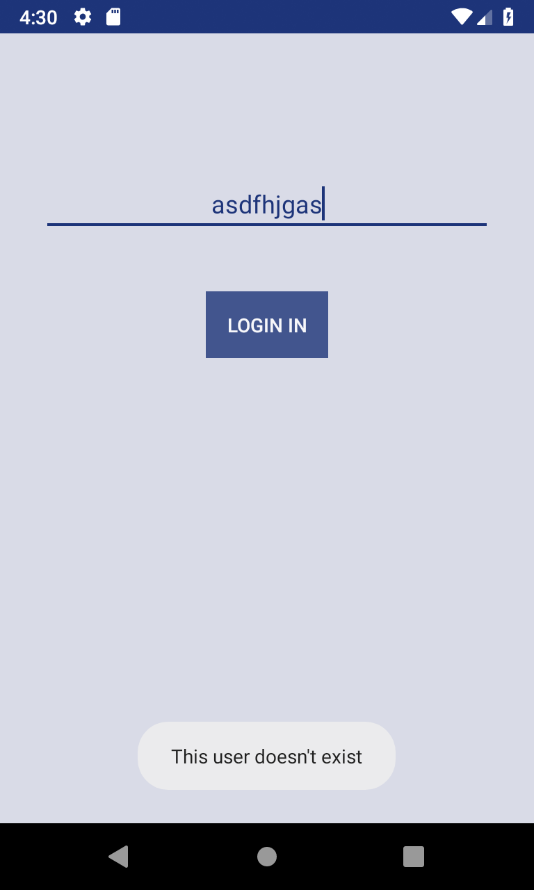
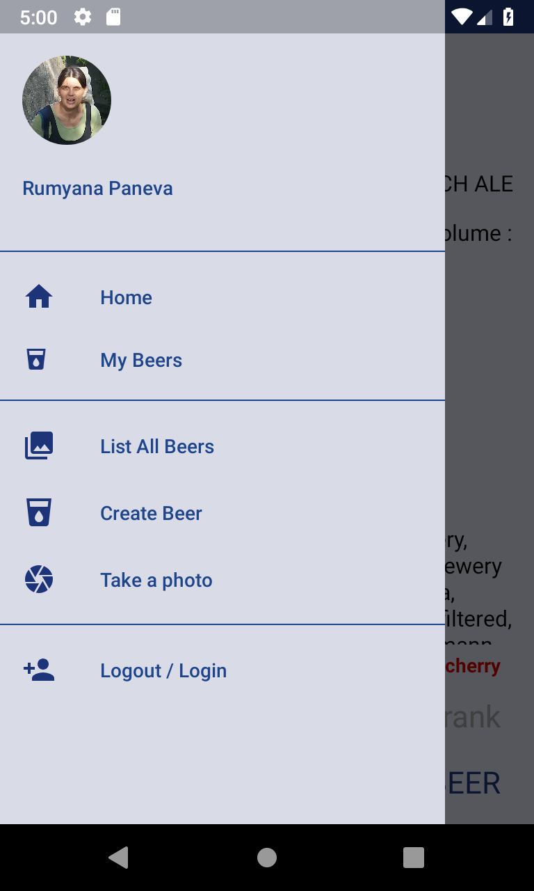
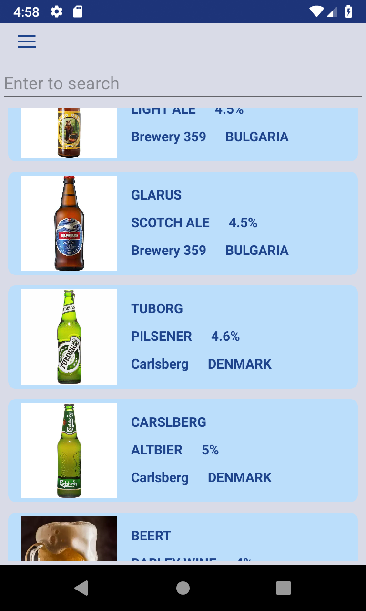
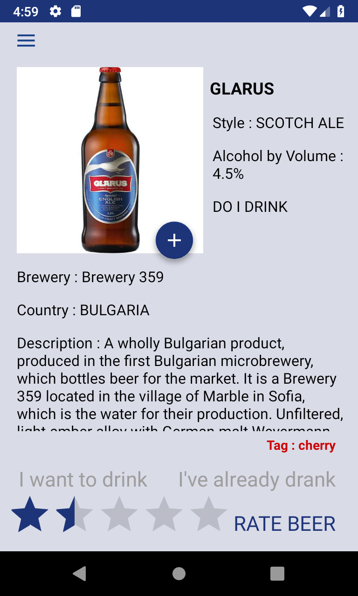
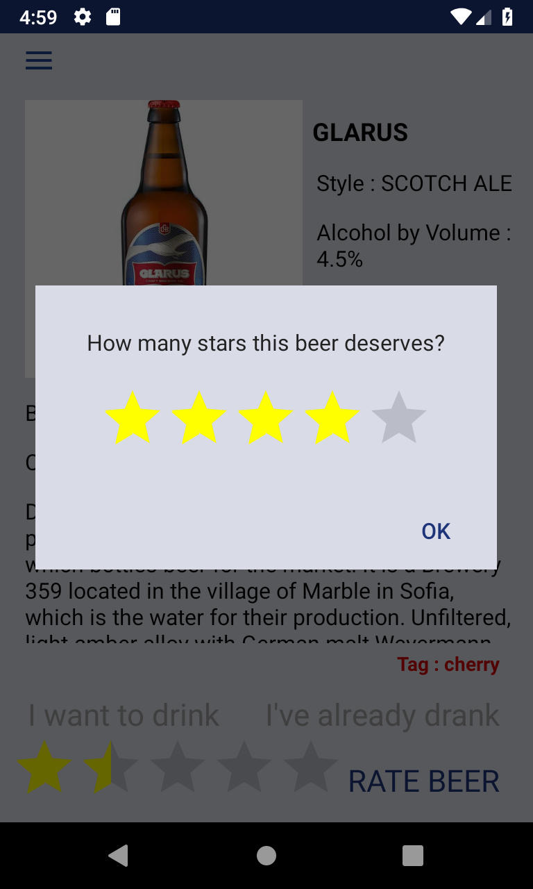
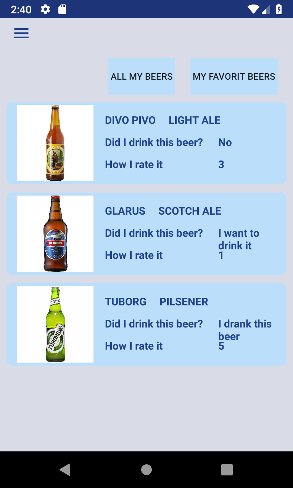
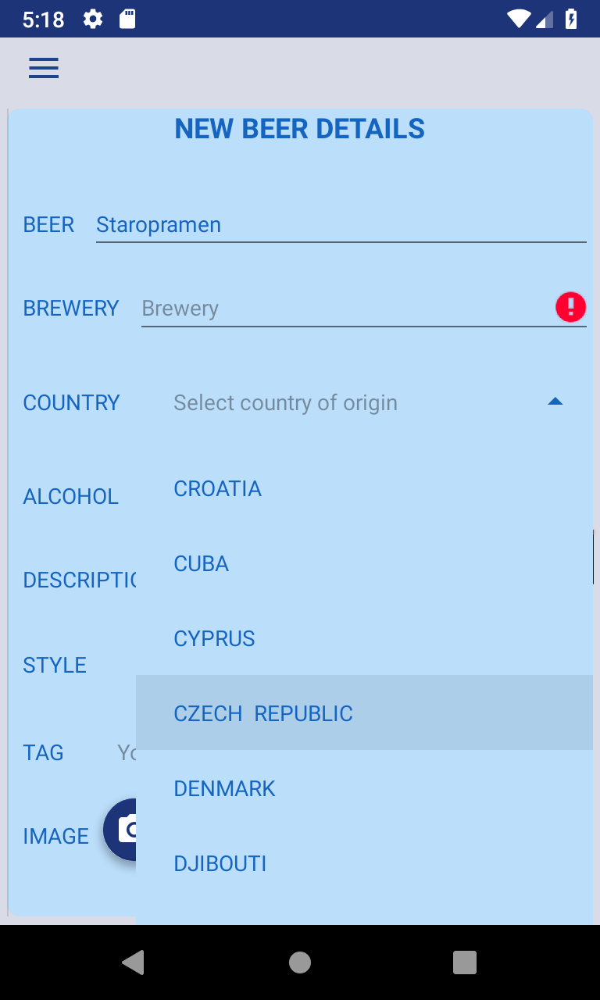

<h1>Beer Tag </h1>

<h2>Project name:</h2>
"BeerTag"

<h2>Summary:</h2>
This app was created for Telerik Academy final project assignment. The front-end part in Android is compatible with Android 8.0 Oreo and above and follows the MVP pattern and SOLID Principles. The backend side of this project was built with Spring and Hibernate for relational database access with MySQL.

<h2>Contributors:</h2>
Rumyana Paneva

<h2>Project purpose:</h2>
*BeerTag 

<h2>Functionalities:</h2>
<ul><li>login - custom user</ul>

<h4>STEP 1 - Home screen </h4>
<ul>
<li> allows the user to proceed to a list of all beers in the system or go to the login/logout window
<li> allows the user to change their own picture with capture a new one or to select from phone's memory
<li> choose an option for their new request with the button in the bottom center  (Login , Beers)
</ul>

<h4>STEP 2 - Allows the user to search through beers details</h4>

<h4>STEP 3 - Allows the user to change some beer details</h4>

<ul>
<li> change the beer picture by taking a picture or select an image from your phone's image files.
<li> rate beer
<li> mark beer: "I want to drink it" or "I've already drank this beer" 
</ul>

<h4>STEP 4 - Allows the user to create and add new beer to the beer list</h4>

<h4>STEP 5 - Allows the user to look for their own beers that he/she has rated or marked like "drank" or "whant to drink" </h4>

<h2>Images</h2>

  .   .     .  
  .   .     .  

<h4>Links</h4>

front-end <a hrev>https://github.com/r-paneva/BeerTag/tree/master/android</a>

back-end <a hrev>https://github.com/r-paneva/BeerTag/tree/master/spring</a>
